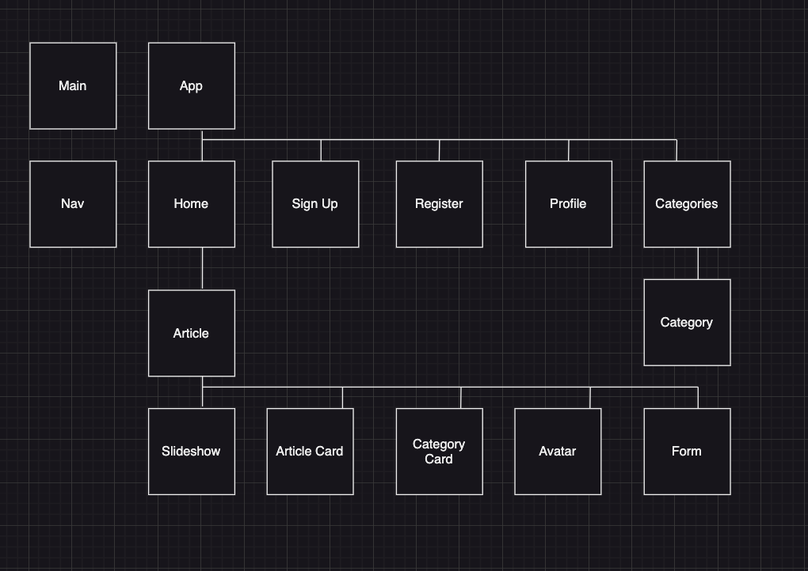
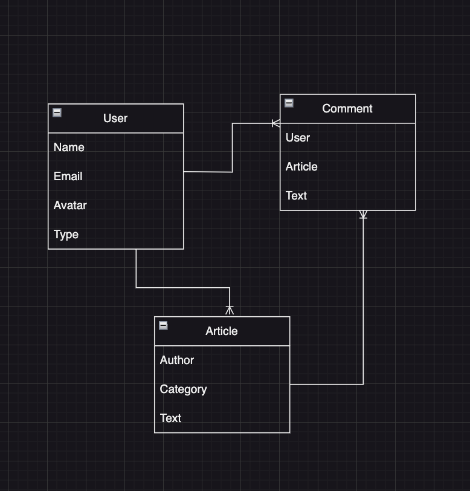

# Omni

## Date: 7/06/2023

### By: Jeremy Cox

[LinkedIN](https://www.linkedin.com/in/jeremy-cox-/)
[GitHub](https://www.github.com/remifreyo/Omni)
[Trello](https://trello.com/b/BdJqM89e/blog)
[Figma](https://www.figma.com/)

---

### **_Description_**

##### Omni is an online magazine that covers a wide array of topics and hosts the ideas of a multitude of thought provoking writers and creative thinkers.

### **_Technologies_**

- HTML
- CSS
- Javascript
- ExpressJS
- NodeJS
- MongoDB
- Mongoose
- React
- Redux
- Material UI

---

### **_Component Hierarchy Diagram_**

### **_Entity Relationship Diagram_**

---

### **_Future Updates_**

- []
